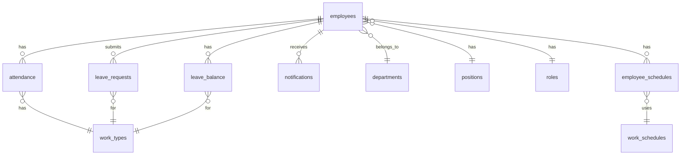

# MASLABS 근태관리 시스템 - 파일 구조

```
maslabs-attendance-system/
│
├── 📁 database/                    # 데이터베이스 관련
│   └── schema.sql                  # 전체 데이터베이스 스키마
│
├── 📁 components/                   # React 컴포넌트
│   ├── EmployeeDashboard.tsx       # 직원 대시보드 화면
│   ├── AttendanceManagement.tsx    # 근태 관리 화면 (관리자)
│   └── EmployeeManagement.tsx      # 직원 관리 화면 (HR)
│
├── 📁 lib/                         # 라이브러리 및 클라이언트
│   └── supabaseClient.ts           # Supabase 클라이언트 설정
│
├── 📁 utils/                       # 유틸리티 함수
│   ├── dateUtils.ts                # 날짜 관련 유틸리티
│   └── phoneUtils.ts               # 전화번호 관련 유틸리티
│
├── 📁 styles/                      # 스타일 파일
│   └── globals.css                 # 전역 CSS 스타일
│
├── 📄 package.json                 # 프로젝트 의존성
├── 📄 tsconfig.json               # TypeScript 설정
├── 📄 tailwind.config.ts          # Tailwind CSS 설정
├── 📄 .env.local.example          # 환경변수 예제
├── 📄 README.md                   # 프로젝트 문서
└── 📄 FILE_STRUCTURE.md           # 파일 구조 문서 (현재 파일)
```

## 📦 핵심 파일 설명

### 1. 데이터베이스 (`database/`)
- **schema.sql**: 완전한 데이터베이스 구조
  - 13개 테이블 정의
  - Row Level Security 정책
  - 트리거 및 함수
  - 기본 데이터 삽입

### 2. 컴포넌트 (`components/`)
- **EmployeeDashboard.tsx**: 
  - 실시간 시계
  - 출퇴근 버튼
  - 근태 현황
  - 휴가 잔여
  
- **AttendanceManagement.tsx**:
  - 근태 목록 조회
  - 승인/반려 처리
  - 필터링 및 검색
  - 엑셀 다운로드
  
- **EmployeeManagement.tsx**:
  - 직원 CRUD
  - 부서/직급 할당
  - 비밀번호 초기화
  - 권한 관리

### 3. 라이브러리 (`lib/`)
- **supabaseClient.ts**:
  - Supabase 연결 설정
  - 인증 헬퍼 함수
  - 데이터베이스 헬퍼
  - 실시간 구독
  - 스토리지 관리

### 4. 유틸리티 (`utils/`)
- **dateUtils.ts**:
  - 한국 날짜 포맷
  - 근무 시간 계산
  - 상대 시간 표시
  
- **phoneUtils.ts**:
  - 전화번호 포맷팅
  - 유효성 검사
  - 마스킹 처리

### 5. 스타일 (`styles/`)
- **globals.css**:
  - CSS 변수 정의
  - 컴포넌트 스타일
  - 유틸리티 클래스
  - 애니메이션
  - 반응형 스타일

## 🎯 싱싱골프에서 추출한 핵심 기능

### ✅ 재사용된 기능
1. **사용자 관리 시스템**
   - 역할 기반 권한 (RBAC)
   - 비밀번호 초기화
   - 활성/비활성 토글

2. **UI 컴포넌트 패턴**
   - 모달 다이얼로그
   - 테이블 레이아웃
   - 필터링 시스템
   - 페이지네이션

3. **유틸리티 함수**
   - 전화번호 포맷팅
   - 날짜 처리

4. **데이터베이스 설계**
   - UUID 기반 ID
   - 타임스탬프 자동 관리
   - RLS 정책

### ❌ 제거된 기능
- 투어 관련 모든 기능
- SMS/카카오톡 알림
- 견적 관리
- 마케팅 캠페인
- 프로모션 페이지

### ➕ 새로 추가된 기능
1. **근태 관리**
   - 출퇴근 체크
   - 위치 기반 인증
   - 근무 시간 자동 계산

2. **대시보드**
   - 실시간 근태 현황
   - 통계 차트
   - 빠른 메뉴

3. **휴가 관리**
   - 휴가 신청/승인
   - 잔여일수 관리

## 🚀 빠른 시작

### 1. 데이터베이스 설정
```sql
-- Supabase SQL Editor에서 실행
-- database/schema.sql 파일 내용 전체 복사하여 실행
```

### 2. 환경 변수 설정
```bash
# .env.local 파일 생성
cp .env.local.example .env.local
# 필요한 값들 입력
```

### 3. 의존성 설치
```bash
npm install
```

### 4. 개발 서버 실행
```bash
npm run dev
```

### 5. 빌드 및 배포
```bash
npm run build
npm run start
```

## 📝 주요 API 엔드포인트

### 인증
- `POST /api/auth/login` - 로그인
- `POST /api/auth/logout` - 로그아웃
- `POST /api/auth/reset-password` - 비밀번호 재설정

### 근태
- `GET /api/attendance` - 근태 목록 조회
- `POST /api/attendance/check-in` - 출근 체크
- `POST /api/attendance/check-out` - 퇴근 체크
- `PUT /api/attendance/:id` - 근태 수정
- `POST /api/attendance/:id/approve` - 근태 승인

### 직원
- `GET /api/employees` - 직원 목록
- `GET /api/employees/:id` - 직원 상세
- `POST /api/employees` - 직원 추가
- `PUT /api/employees/:id` - 직원 수정
- `DELETE /api/employees/:id` - 직원 삭제

### 휴가
- `GET /api/leaves` - 휴가 목록
- `POST /api/leaves` - 휴가 신청
- `PUT /api/leaves/:id/approve` - 휴가 승인
- `PUT /api/leaves/:id/reject` - 휴가 반려

## 🔒 보안 고려사항

1. **Row Level Security (RLS)**
   - 모든 테이블에 RLS 정책 적용
   - 역할별 접근 권한 제어

2. **인증 및 권한**
   - Supabase Auth 사용
   - JWT 토큰 기반 인증
   - 역할 기반 접근 제어 (RBAC)

3. **데이터 보호**
   - 민감 정보 암호화
   - HTTPS 통신 강제
   - XSS/CSRF 방어

## 📊 데이터베이스 테이블 관계



## 🛠 개발 도구

- **Next.js 15.3.1** - React 프레임워크
- **TypeScript 5** - 타입 안전성
- **Tailwind CSS 3.4** - 스타일링
- **Supabase** - 백엔드 서비스
- **Lucide Icons** - 아이콘
- **Recharts** - 차트 라이브러리

## 📱 반응형 디자인

- 모바일 (< 768px)
- 태블릿 (768px - 1024px)
- 데스크톱 (> 1024px)

## 🌐 브라우저 지원

- Chrome 90+
- Firefox 88+
- Safari 14+
- Edge 90+

## 📄 라이선스

MASLABS 내부 사용 전용 (PROPRIETARY)

---

**개발팀 연락처**: dev@maslabs.com
